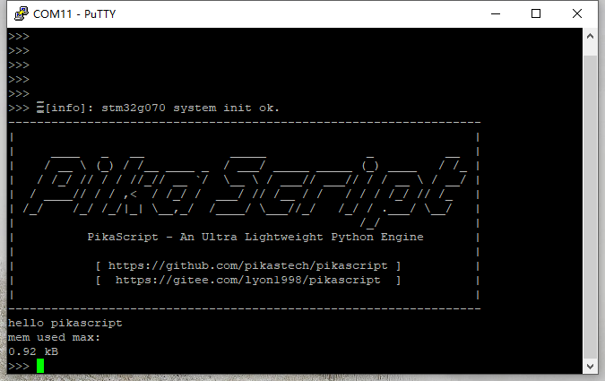

<p align="center">
	
</p>
<h1 align="center" style="margin: 30px 0 30px; font-weight: bold;">PikaScript</h1>
<h4 align="center">Cross platform ultra lightweight embedded Python engine</h4>
<p align="center">
	<a href="https://gitee.com/lyon1998/pikascript/stargazers"></a>
	<a href="https://gitee.com/lyon1998/pikascript/members"></a>
	<a href="https://github.com/pikastech/pikascript/stargazers"></a>
	<a href="https://github.com/pikastech/pikascript/network/members"></a>
	<a href="https://github.com/pikastech/pikascript/watchers"></a>
	<a href="https://github.com/pikastech/pikascript/issues"></a>
	<a href="https://github.com/pikastech/pikascript/blob/master/LICENSE"></a>
  <a href="https://github.com/pikasTech/pikascript/actions/workflows/CI.yml"> </a>
</p>

<p align="center">
	<a href="README_zh.md" >中文页</a> |
	<a href="https://whycan.com/f_55.html" >Forum</a> |
	<a href="https://pikadoc.readthedocs.io/en/latest/index.html" >Documents</a> |
	<a href="https://space.bilibili.com/5365336/channel/detail?cid=202329">Videos</a> |
        <a href="../../tree/master/bsp#platform-support">BSP</a> |
	<a href="https://pikadoc.readthedocs.io/en/latest/%E5%8C%85%E7%AE%A1%E7%90%86%E5%99%A8%E4%B8%8E%E6%A8%A1%E5%9D%97%E7%AE%A1%E7%90%86.html">Package Manager</a> |
	<a href="https://pikadoc.readthedocs.io/en/latest/%E4%BB%8E%20RT-Thread%20%E8%BD%AF%E4%BB%B6%E5%8C%85%E5%BC%80%E5%A7%8B.html" >RT-Thread package</a> |
	<a href="https://pikadoc.readthedocs.io/en/latest/%E5%A6%82%E4%BD%95%E5%8F%82%E4%B8%8E%E7%A4%BE%E5%8C%BA%E8%B4%A1%E7%8C%AE.html" >Contribute</a> |
	<a href="https://pikadoc.readthedocs.io/en/latest/%E5%95%86%E4%B8%9A%E5%90%88%E4%BD%9C%E6%96%B9%E5%BC%8F.html">Business</a> 
</p>

[](https://pikastech.github.io/pikascript/dev/bench/)

# 1. Abstract

PikaScript is an ultra-lightweight Python engine with zero dependencies and zero-configuration, that can run with 4KB of RAM and 32KB of flash (such as STM32G030C8 and STM32F103C8).


It's very easy to bind C function to python module with the help of Pika Pre-compiler.Only write the API of python in `.pyi` and the bindings are autoly generated by Pre-compiler.

The Pre-compiler is fully open-source, and the source code is in the [tools](https://github.com/pikasTech/pikascript/tree/master/tools) folder.


# Get PikaScript:

## Use Online Project Generator
Generator url:
http://pikascript.com

Note: You need the [Community Edition license (Now Free)](https://www.keil.com/pr/article/1299.htm) to build Keil projects, and the version of Keil should be newer than v5.36.

[](http://pikascript.com)

## Use Pika package manager [PikaPackage.exe](https://pikadoc.readthedocs.io/en/latest/%E5%8C%85%E7%AE%A1%E7%90%86%E5%99%A8%E4%B8%8E%E6%A8%A1%E5%9D%97%E7%AE%A1%E7%90%86.html)

1. Run the [PikaPackage.exe](https://gitee.com/Lyon1998/pikascript/attach_files/907478/download) directly, then the pikascript repo would be downloaded auto in the /tmp/pikascript folder of your current disc partition.

2. Add [requestment.txt](/bsp/stm32g070cb/pikascript/requestment.txt) to the same folder of PikaPackage.exe then run [PikaPackage.exe](../../raw/master/tools/pikaPackageManager/pikaPackage.exe). The [run-time core](../../tree/master/src), [pre-compiler](../../tree/master/tools/pikaCompiler) and [moudles](../../tree/master/package) would be installed in the current folder.

3. Released modules：[packages.toml](packages.toml)

# Quick Start

You can use [simulation project](https://pikadoc.readthedocs.io/en/latest/Keil%20%E4%BB%BF%E7%9C%9F%E5%B7%A5%E7%A8%8B.html) to quick start without hardware，or use the out-of-the-box develop board [Pika-Pi—Zero](https://item.taobao.com/item.htm?spm=a2126o.success.result.1.76224831Y0X1gO&id=654947372034).


The board based on STM32G030C8T6 MCU, only 64kB Flash, 8kB RAM can run PikaScript with total peripheral device (GPIO、TIME、IIC、RGB、KEY、LCD、RGB). 
CH340 is deployed to support USB to serial with Type-C USB, support download python script py serial, there are 4 RGB on the board and support the [LCD](https://item.taobao.com/item.htm?spm=a1z10.3-c.w4002-23991764791.12.16f97c58fsLjVk&id=660745643102).

# Related Projects

- ⭐ [PikaScript Bluepill Demo In PlatformIO — Python-like REPL 🐍🔌](https://github.com/maxgerhardt/pikascript-pio-bluepill)

- ⭐ [PikaScript Bluepill Demo In GCC 🐍](https://github.com/Chandler-Kluser/pikascript_gcc_bluepill)

# Document

https://pikadoc.readthedocs.io/en/latest/index.html

## How to contribute

https://pikadoc.readthedocs.io/en/latest/%E5%A6%82%E4%BD%95%E5%8F%82%E4%B8%8E%E7%A4%BE%E5%8C%BA%E8%B4%A1%E7%8C%AE.html

## Folders
[src](../../tree/master/src) - core code

[bsp](../../tree/master/bsp) - mcu/board support

[port](../../tree/master/port) - OS and package manager

[test](../../tree/master/port/linux/test) - unit test

[document](../../tree/master/document) - developt document

[examples](../../tree/master/examples) - example scripts

[package](../../tree/master/package) - packages and moudles

[pikaCompiler](../../tree/master/tools/pikaCompiler) - pre-compiler write by Rust, used to bind C function to python moudle.

[pikaPackageManager](../../tree/master/tools/pikaPackageManager) - pacakge manager

# 2.Platform support


## MCU support
|MCU            |bsp|gpio|time|uart|pwm|adc|i2c|
|---|---|---|---|---|---|---|---|
|stm32g030c8    |√  |√   |√   |√   |√  |√  |√  |
|stm32g070cB    |√  |√   |√   |√   |√  |√  |√  |
|stm32f103c8    |√  |√   |√   |√   |√  |√  |√  |
|stm32f103rb    |√  |√   |√   |√   |√  |√  |√  |
|stm32f103ze    |√  |√   |√   |√   |√  |√  |√  |
|stm32f103rc    |√  |√   |√   |√   |√  |√  |√  |
|stm32f401cc    |√  |√   |√   |√   |√  |√  |√  |
|stm32f411ce    |√  |√   |√   |√   |√  |√  |√  |
|stm32f407ze    |√  |    |    |    |   |   |   |
|stm32f407zg    |√  |    |    |    |   |   |   |
|stm32h750vb    |√  |    |    |    |   |   |   |
|stm32f051r8    |√  |    |    |    |   |   |   |
|air32f103cb    |√  |√   | √      |    |   |   |   |
|ch582          |√  |√   |√   |√   |   |√  |√  |
|ch32v103r8t6   |√  |√   |√   |    |   |   |   |
|cm32m101a      |√  |    |    |    |   |   |   |
|w806           |√  |√   |√   |√   |√  |√  |√  |
|apm32f030r8    |√  |    |    |    |   |   |   |
|apm32e103vb    |√  |    |    |    |   |   |   |
|bl-706         |√  |    |    |    |   |   |   |
|Raspberry Pico |√  |    |    |    |   |   |   |
|ESP32C3        |√  |√   |√   |    |   |   |   |
|TC264D         |√  |    |    |    |   |   |   |
|devc           |√  |    |    |    |   |   |   |
|visual-studio  |√  |    |    |    |   |   |   |
|EC600N         |√  |    |    |    |   |   |   |
|mm32f5277e9p   |√  |√   |    |    |   |   |   |
|xr806(openharmony)|√  |    |    |    |   |   |   |


## Board support
|Board|bsp|gpio|uart|pwm|adc|i2c|rgb|lcd|arm-2d|
|---|---|---|---|---|---|---|---|---|---|
|[Pika-Pi-Zero](https://item.taobao.com/item.htm?spm=a230r.1.14.1.4f2e27a8R0qWJn&id=654947372034&ns=1&abbucket=15#detail)|√|√|√|√|√|√|√|√|√|

|Board|bsp|pika_lvgl|
|---|---|---|
|lvgl-vs-simu|√|√|
|swm320|√|√|

|Board|bsp|arm-2d|
|---|---|---|
|QEMU-arm2d|√|√|

|Board|bsp|LED|KEY|
|---|---|---|---|
|SmartLoong|√|√|√|√|
## OS support
|OS|port|GPIO|TIME|PWM|
|---|---|---|---|---|
|RT-Thread|√|√|√|√|
|vsf|√|√| | |

|OS|port|Google Test|Benchmark|
|---|---|---|---|
|linux|√|√|√|

# 3.Characteristic
### (1)Run environment

Support run in mcu without OS or file system. Can run in everywhere with **RAM ≥ 4kB** and **FLASH ≥ 32kB**，such as stm32g030, stm32f103c8t6，esp8266.

### (2)Develop enviroment

#### Support REPL by serial.

<br/>

#### Support run and program python scripts by serial.

<br/>

Support IDEs like Keil, IAR, RT-Thread studio and segger embedded studio to develop C moudle.

Support build tools like CMake, makeFile and Scons.

Zero dependencies, zero configuration,  out-of-the-box, easy to integrated into privious C projcet.

Eazy to extern customized C moudles.

Support linux.

### (3)Syntax 

Support subaggregate of python 3 standard syntax.

Support class and method define, encapsulation-inheritance-polymorphism and moudles in `.pyi ` of C module.

|Syntax|Compile-Time|Run-Time|Shell|
|---|---|---|---|
|Module Define          |√|-|-|
|Module Import          |√|√|√|
|Class Define           |√|√|√|
|Class Inherit          |√|√|√|
|Method Define          |√|√|√|
|Method Override        |√|√|√|
|Method Invoke          |√|√|√|
|Argument Define        |√|√|√|
|Argument Assignment    |√|√|√|
|Object New             |√|√|√|
|Object Free            |√|√|√|
|Object Nest            |√|√|√|
|Control flow           |√|√|√|

#### Operator

| + | - | * | / | == | > | < | >= | <= | % | ** | // | != | & | >> | << | and | or | not | in | += | -= | *= | /= |
|---|---|---|---|---|---|---|---|---|---|---|---|---|---|---|---|---|---|---|---|---|---|---|---|
|√|√|√|√|√|√|√|√|√|√|√|√|√|√|√|√|√|√|√|√|√|√|√|√|

#### Control flow

| Syntax | State |
| --- | --- |
| if | √ |
| while | √ |
| for in [list] | √ |
| for in range(a, b) | √ |
| for in [dict] | √ |
| if elif else | √ |
| for break/continue | √ |
| while break/continue | √ |

#### Module

| Syntax | Python Module | C Module |
| --- | --- | --- |
| import [module] | √ | √ |
| import [module] as | √ | - |
| from [module] import [class/function>]| √ | - |
| from [module] import [class/function>] as | √ | - |
| from [module] import * | - | PikaObj Module Only |

#### List/Dict
| Syntax | State |
| --- | --- |
| l = list() | √  |
| l = [a, b, c] | √ |
| d = dict() | √ |
| d = {'a':x, 'b':y, 'c':z} | √ |

#### Exception

| Syntax | State |
| --- | --- |
|try:| √ |
|except:| √ |
|except [Exception]:| - |
|except [Exception] as [err]: | - |
|except: ... else:| - |
|raise:| √ |
|raise [Exception]:| - |
|finally:| - |

#### Slice

| Syntax | str | bytes | list |
| --- | --- | --- | --- |
| test[i] | √ | √ | √ |
| test[a : b] | √ | √ | √ | 
| test[a :] | √ | √ | √ |

#### Other keywords/Syntax

| yield | is | comprehensions |
| --- | --- | --- |
| - | √ | - |

### (4)Develop standard.

Readability first, nearly never use macro function and global argument.

Complete unit testes based on google test.

# 4.Both talk and show the code：

## Telegram


https://t.me/+JL3TZ9k-Lfg2OWE1

## E-mail: liang6516@outlook.com

# 5.Demo 

The scripts in demos are in the [examples](examples) folder.

## Demo 01 GPIO

``` python
import PikaStdLib
import STM32G0

mem = PikaStdLib.MemChecker()
io1 = STM32G0.GPIO()
time = STM32G0.Time()

io1.setPin('PA8')
io1.setMode('out')
io1.enable()
io1.low()

print('hello pikascript')
print('mem.max :')
mem.max()
print('mem.now :')
mem.now()

while True:
    io1.low()
    time.sleep_ms(500)
    io1.high()
    time.sleep_ms(500)

```


## Demo 02 USART

``` python
import PikaStdLib
import STM32G0

time = STM32G0.Time()
uart = STM32G0.UART()
uart.setId(1)
uart.setBaudRate(115200)
uart.enable()

while True:
    time.sleep_ms(500)
    readBuff = uart.read(2)
    print('read 2 char:')
    print(readBuff)

```


## Demo 03 ADC

``` python
import PikaStdLib
import STM32G0

time = STM32G0.Time()
adc1 = STM32G0.ADC()

adc1.setPin('PA1')
adc1.enable()

while True:
    val = adc1.read()
    print('adc1 value:')
    print(val)
    time.sleep_ms(500)

```


## Demo 04 PWM output

``` python
import PikaStdLib
import STM32G0

time = STM32G0.Time()
pwm = STM32G0.PWM()
pwm.setPin('PA8')
pwm.setFrequency(2000)
pwm.setDuty(0.5)
pwm.enable()

while True:
    time.sleep_ms(500)
    pwm.setDuty(0.5)
    time.sleep_ms(500)
    pwm.setDuty(0.001)
    
```

## Demo 05 RGB

``` python
import STM32G0
import PikaPiZero
import PikaStdLib

rgb = PikaPiZero.RGB()
mem = PikaStdLib.MemChecker()

rgb.init()
rgb.enable()

print('hello 2')
print('mem used max:')
mem.max()

while True:
    print('flowing')
    rgb.flow()

```

## Demo 06 Snake(Need LCD)

``` python
from PikaObj import *
import PikaStdLib
import PikaPiZero
import STM32G0

# hardware init
lcd = PikaPiZero.LCD()
lcd.init()
lcd.clear('white')
key = PikaPiZero.KEY()
key.init()
time = STM32G0.Time()
x_max = 120
y_max = 150

# snake init
s = PikaPiZero.Point()
w = 9
h = 9
s.x = 50
s.y = 10
len = 0
while len < 3:
    b = s
    i = 0
    while i < len:
        b = b.next
        i = i + 1
    b.next = PikaPiZero.Point()
    b.next.x = b.x - 10
    b.next.y = b.y
    b.next.prev = b
    len = len + 1
# ring link
b.next = s
s.prev = b

i = 0
b = s
while i < len:
    lcd.fill(b.x, b.y, w, h, 'blue')
    b = b.next
    i = i + 1

print('snake lengh')
print(len)

# fruit init
f = PikaPiZero.Point()
f.x = 30
f.y = 20
lcd.fill(f.x, f.y, w, h, 'green')

# memory check
mem = PikaStdLib.MemChecker()
print('mem used max:')
mem.max()

# main loop
d = 0
isUpdate = 1
isEat = 0
while True:
    if isUpdate:
        # isUpdate = 0
        # check eat fruit
        if f.x == s.x and f.y == s.y:
            # have eat fruit
            isEat = 1
            f.x = f.x + 30
            if f.x > x_max:
                f.x = f.x - x_max
            f.y = f.y + 30
            if f.y > y_max:
                f.y = f.y - y_max
            lcd.fill(f.x, f.y, w, h, 'green')
        # move snake by the direction
        if d == 0:
            x_new = s.x + 10
            y_new = s.y
            if x_new > x_max:
                x_new = 0
        elif d == 1:
            x_new = s.x
            y_new = s.y - 10
            if y_new < 0:
                y_new = y_max
        elif d == 2:
            x_new = s.x
            y_new = s.y + 10
            if y_new > y_max:
                y_new = 0
        elif d == 3:
            x_new = s.x - 10
            y_new = s.y
            if x_new < 0:
                x_new = x_max
        if isEat:
            isEat = 0
            b_new = PikaPiZero.Point()
            b_new.x = x_new
            b_new.y = y_new
            b_new.prev = s.prev
            b_new.next = s
            s.prev.next = b_new
            s.prev = b_new
            s = b_new
            len = len + 1
            print('snake lengh')
            print(len)
            print('mem used max:')
            mem.max()
        # drow the snake and fruit
        # clear last body
        lcd.fill(s.prev.x, s.prev.y, w, h, 'white')
        # new body
        s.prev.x = x_new
        s.prev.y = y_new
        # head is last body
        s = s.prev
        lcd.fill(s.x, s.y, w, h, 'blue')
        b = s
        i = 0
    # scan key
    key_val = key.get()
    if key_val == 0:
        d = 0
        isUpdate = 1
    elif key_val == 1:
        d = 1
        isUpdate = 1
    elif key_val == 2:
        d = 2
        isUpdate = 1
    elif key_val == 3:
        d = 3
        isUpdate = 1
	
```


The maximum RAM usage of these demos is only 3.56K, which is 4.56K if the 1K stack is included, and the maximum Flash usage is 30.4K. Refer to the 20K RAM and 64K Flash of STM32F103C8T6, less than 25% RAM and less than 50% Flash are used.

A quick comparison can be made between the microPython's MCU STM32F405RG and the PikaScript's MCU STM32G070CB.

## RAM resource comparison


## Flash Resource Comparison


## Reference price comparison (take the selling price of 10 pieces in Lichuang Mall on September 11, 2021 as reference)


## About the custom extern module ？

In addition to device drivers, developing custom Python modules for MCU is very easy. The following two demos are extensions of the custom module, which developed python interfaces for the ARM-2D image driver library.

## Boxes~


## Rotating suns~


# 6.Test and develop Core

## Test core in docker (recommend)
[get start with docker](https://pikadoc.readthedocs.io/en/latest/get-start_linux.html)

# ✨ Contributors

<a href="https://github.com/pikastech/pikascript/graphs/contributors">
  
</a>

## [How to contribute](https://pikadoc.readthedocs.io/en/latest/%E5%A6%82%E4%BD%95%E5%8F%82%E4%B8%8E%E7%A4%BE%E5%8C%BA%E8%B4%A1%E7%8C%AE.html)

| Contributer | [Achivements](document/achivement.md) |
| ----------------------------------------------------- | :----------------------------------------------------------- |
| [甜航](https://github.com/easyzoom)                   |  |
| 千帆(微信名)                                          |  |
| [ Meco Jianting Man](https://github.com/mysterywolf)  | |
| [liuduanfei](https://github.com/liuduanfei)           |  |
| [ sjy](https://gitee.com/shanjiayang)                 |  |
| 沧御                                                  |  |
| [versaloon](https://github.com/versaloon)             |  |
| 刘延(微信名)                                          |  |
| [GorgonMeducer](https://github.com/GorgonMeducer)     |  |
| [unsigned](https://gitee.com/unsigned0)               |  |
| [梦程MI](https://gitee.com/dreamcmi)                  |  |
| [Maximilian Gerhardt](https://github.com/maxgerhardt) |  |
| [purewind7](https://gitee.com/purewind7)              |  |
| [ onceday](https://gitee.com/onceday)                 |  |


<div class="log"></div>

| Contribute log | Contributer |
| --- | --- |
| re module | [eglwang](https://gitee.com/eglwang) |
| PikaMath.Quaternion() | [purewind7](https://gitee.com/purewind7) |
| contrubute to PikaCV | [purewind7](https://gitee.com/purewind7) |
| xr806(openharmony) bsp |[sjy](https://gitee.com/shanjiayang)|
| ESP32 package |沧御|
| MM32F5277E9P package |[unsigned](https://gitee.com/unsigned0)|
| mm32f5277e9p BSP |[unsigned](https://gitee.com/unsigned0)|
| Add [CMSIS-PACK](https://pikadoc.readthedocs.io/en/latest/get-start_cmsis-pack.html) | [GorgonMeducer](https://github.com/GorgonMeducer) |
| donate: air32f103 board * 20 | 合宙 [xinxi204](https://gitee.com/xinxi204) |
| contrubute to PikaMath.Math() | [onceday](https://gitee.com/onceday) |
| add support for Unix Time | [onceday](https://gitee.com/onceday) |
| contrubute to PikaStdLib.String() | [purewind7](https://gitee.com/purewind7) |
| Add [PLOOC](https://github.com/GorgonMeducer/PLOOC) support for PikaScript Core | [GorgonMeducer](https://github.com/GorgonMeducer) |
| Donate：500¥ (ctypes 相关） | 蒋太平 |
| fix linux install script | [Maximilian Gerhardt](https://github.com/maxgerhardt) |
| ch582 package | [梦程MI](https://gitee.com/dreamcmi) |
| ch582 BSP | [梦程MI](https://gitee.com/dreamcmi) |
| Donate：EC600X QuecPython Develop board| 移远通信 武加玉 |
| Performance Point: 900->1400 | [GorgonMeducer](https://github.com/GorgonMeducer) |
| stm32f051r8 BSP |[unsigned](https://gitee.com/unsigned0)|
| stm32f407ze BSP |[unsigned](https://gitee.com/unsigned0)|
| devc BSP |[unsigned](https://gitee.com/unsigned0)|
| TC264D BSP |[unsigned](https://gitee.com/unsigned0)|
| PikaVM improvement | [GorgonMeducer](https://github.com/GorgonMeducer) |
| W801Device package | 刘延(微信名) |
| W806 bsp | 刘延(微信名) |
| Donate：ESP32C3 5pic，linker|启明云端 沧御|
| Donate：LS1C101 mcu 10pic, LS1c101 develop board，debuger|龙芯俱乐部 石南|
| PikaVSF OS package | [versaloon](https://github.com/versaloon) |
| ESP32C3 BSP |沧御|
| Donate：ESP32 board、ink lcd*4 | name(微信名) |
| Donate：smartloong board | 龙芯俱乐部 石南 |
| package/STM32F1 | [sjy](https://gitee.com/shanjiayang) |
| package/STM32F103RBBooter | [sjy](https://gitee.com/shanjiayang) |
| bsp/stm32f103rb | [sjy](https://gitee.com/shanjiayang) |
| QEMU ARM-2D simulation proejct | [liuduanfei](https://github.com/liuduanfei) |
| Donate：GD32E103TB2 2 pic | 信息牛(微信名) |
| Rt-thread bsp、port、module| [Meco Jianting Man](https://github.com/mysterywolf) |
| Donate：EC600S-CN 4G| 移远模块 |
| Donate：BL706 board|博流智能 [bouffalolab](https://github.com/bouffalolab)|
| Donate：CM32M101A 开发板| 孟巍(微信名) |
| Donate：APM32F030R8 board | 极海半导体 陈成 |
| Donate：APM32E103VB board | 极海半导体 陈成 |
| Donate：APEX-Link| 极海半导体 陈成 |
| corde format，add gitattributes| [Meco Jianting Man](https://github.com/mysterywolf) |
| demo/simulation-keil | 千帆(微信名) |
| demo/stm32f103zet6/demo01-led-stm32f103zet6 | [甜航](https://github.com/easyzoom) |
| demo/stm32f103zet6/demo02-led-stm32f103zet6_tworoot | [甜航](https://github.com/easyzoom) |
| demo/stm32f407zgt/demo01-led-stm32f407vgt | [甜航](https://github.com/easyzoom) |


## Star History

[](https://star-history.com/#pikastech/pikascript&Date)
