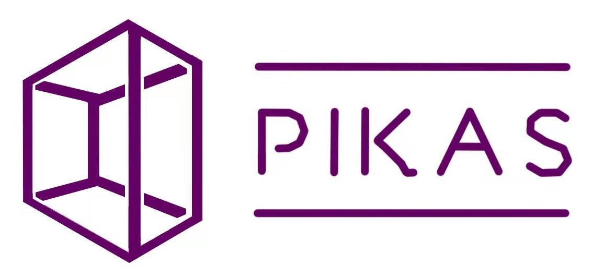
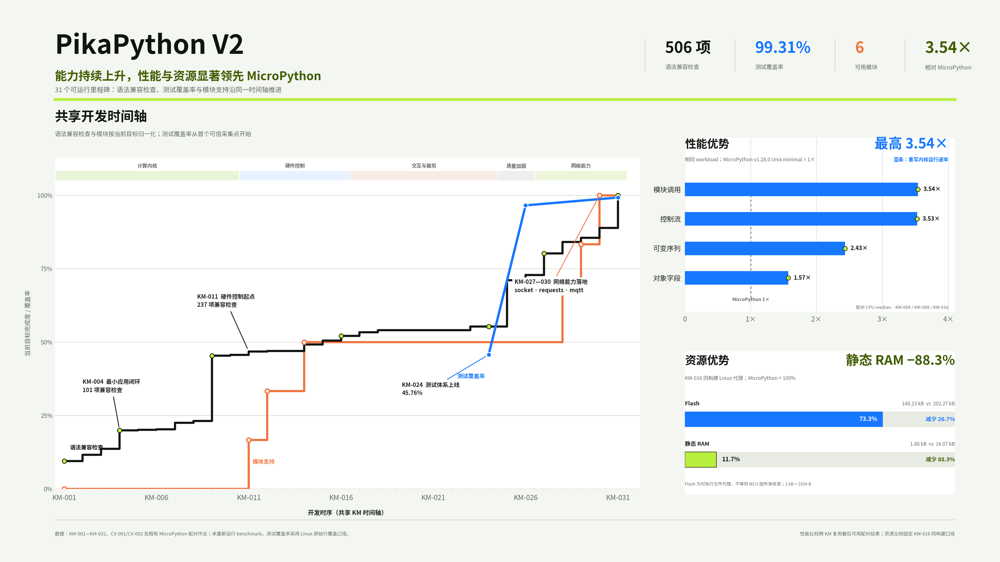

<p align="center">
  
</p>

<h1 align="center">PikaPython v2</h1>
<p align="center">跨平台的超轻量级嵌入式 Python 引擎</p>

PikaPython v2 提供面向嵌入式设备的 Python 内核、模块包、项目模板和统一构建 CLI。
源码与项目模板发布在 `pikasTech/PikaPython` 仓库的 `v2` 分支。

## V2 性能与资源改进



相同 workload、匹配 CPU 的 Linux 对比中，PikaPython v2 相对于 MicroPython
v1.28.0 Unix minimal 的结果包括：

- 模块调用最高 `3.54x`；
- 控制流 `3.53x`；
- 可变序列 `2.43x`；
- 对象字段 `1.57x`。

资源与完整性指标：

- Flash 为 `148.23 kB`，MicroPython 为 `202.27 kB`，减少 `26.7%`；
- 静态 RAM 为 `1.88 kB`，MicroPython 为 `16.07 kB`，减少 `88.3%`；
- 完成 `506` 项语法兼容检查，测试覆盖率为 `99.31%`；
- 提供 `6` 个可用模块和 `31` 个可运行里程碑程序。

性能数字来自匹配 CPU 的 Linux 测量，不是 QEMU 模拟速度。QEMU 只用于功能、
Flash、RAM 和故障恢复验证，不用于性能结论。图表与指标来源：
[`pikasTech/pikapython-v2-preview-stm32f4-qemu`](https://github.com/pikasTech/pikapython-v2-preview-stm32f4-qemu)。

## 首选入口：PikaPython CLI Skill

使用 PikaPython v2 创建项目、安装模块、配置 capability、生成 binding、构建模板或
诊断 CLI 时，优先阅读并遵循 [`skills/pikapython-cli/SKILL.md`](skills/pikapython-cli/SKILL.md)。

使用 Codex、Claude Code 等 Code Agent 开发时，可以直接要求 Code Agent 读取并遵循
该 Skill。Code Agent 可以按照其中的标准工作流完成项目创建、依赖安装、配置、
预构建、目标构建和问题诊断。

## 通用 Python 示例

以下示例展示函数、循环和算术等基础写法，可以直接作为 V2 项目模板的 `main.py`：

```python
def square(value):
    return value * value


for value in range(4):
    print(square(value))
```

V2 继续使用 `.pyi` 描述 Python 可见 API，并由 CLI 生成 C binding。模块声明、
C callback 和 Program Image 的完整流程见
[`docs/reference/modules-and-bindings.md`](docs/reference/modules-and-bindings.md)。

## 第二入口：手动使用 CLI

以下方式直接运行仓库内的 `pikapython_cli`，不需要通过 pip 安装：

```bash
git clone --branch v2 --single-branch https://github.com/pikasTech/PikaPython.git
cd PikaPython
python3 skills/pikapython-cli/scripts/pikapython-cli.py --help
```

前置条件：

- Python 3.9 或更高版本；
- Python 环境中已有 `PyYAML>=6.0,<7`；
- Git、CMake 和可用的 C 编译器。

## 构建并运行 Linux 模板

复制 Linux 模板，然后安装依赖并构建：

```bash
mkdir -p ../pika-linux-app
cp -R project-templates/linux-console/. ../pika-linux-app/
cd ../pika-linux-app

python3 ../PikaPython/skills/pikapython-cli/scripts/pikapython-cli.py install
python3 ../PikaPython/skills/pikapython-cli/scripts/pikapython-cli.py build
python3 tools/verify-linux-output.py
```

自动验证通过后，可以交互运行生成的 Linux 程序；按 `Ctrl-D` 退出 REPL：

```bash
./.pikapython/build/linux/linux-console
```

模板默认从 `pikasTech/PikaPython` 的 `v2` 分支安装依赖。

更多配置、平台模板和模块开发说明见 [`docs/reference/index.md`](docs/reference/index.md)。

## 交流与资源

- [GitHub Issues](https://github.com/pikasTech/PikaPython/issues)：报告 V2 问题和跟踪产品进展；
- [PikaPython 论坛](https://whycan.com/f_55.html)：交流移植、模块和嵌入式应用；
- [PikaPython 视频](https://space.bilibili.com/5365336/channel/seriesdetail?sid=1034902)：
  查看项目介绍与开发内容。
