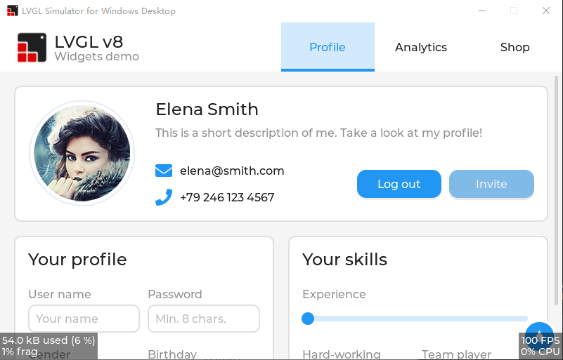

This Repo is Forked from https://github.com/lvgl/lv_port_win_visual_studio

# What is PikaScript ?

[PikaScript](https://github.com/pikastech/pikascript) is a Python interpreter designed specifically for microcontrollers, and it supports a subset of the common Python3 syntax.

It's lighter, requiring only 32k of code space and 4k of RAM, which means it can run on stm32f103c8 (blue-pile) or even stm32f030c8, on the other hand, you can leave valuable space for more material or build larger buffer areas.

It is simpler, out of the box, runs with no porting and configuration at all, does not depend on OS and file system, has good support for popular IDEs for Windows platforms like Keil, IAR, RT-Thread-Studio, and of course, supports linux-gcc development platforms.

It's smarter, with a unique C module mechanism that allows you to generate bindings automatically by simply writing the API for the C module in Python, and you don't need to deal with the headache of writing any macros or global tables manually. On the other hand, all C modules have sophisticated smart hints, even hinting at the types of your arguments .

---

# Why PikaScript + LVGL ?

PikaScript now supports the main features of LVGL8, and these APIs are fully compatible with Micropython!

This means that you can continue to use already written code from Micropython, and then use less code space and RAM.

The peak memory footprint of the ring animation DEMO is just 6.56kB


Enjoy detailed code hints down to the parameter type for a better programming experience


Use a more convenient IDE, such as vs-based simulation projects


# So how does it look like?

Here are some examples of lvgl that PikaScript can already run, they are mainly from the lvgl documentation examples

## LV_ARC

```python
import pika_lvgl as lv
import PikaStdLib
mem = PikaStdLib.MemChecker()

# Create an Arc
arc = lv.arc(lv.scr_act())
arc.set_end_angle(200)
arc.set_size(150, 150)
arc.center()

print('mem used max: %0.2f kB' % (mem.getMax()))
print('mem used now: %0.2f kB' % (mem.getNow()))

```


## LV_BAR

``` python
import pika_lvgl as lv
import PikaStdLib
mem = PikaStdLib.MemChecker()

bar1 = lv.bar(lv.scr_act())
bar1.set_size(200, 20)
bar1.center()
bar1.set_value(70, lv.ANIM.OFF)

print('mem used max: %0.2f kB' % (mem.getMax()))
print('mem used now: %0.2f kB' % (mem.getNow()))
```


## LV_BTN

``` python
import pika_lvgl as lv
import PikaStdLib
mem = PikaStdLib.MemChecker()


def event_cb_1(evt):
    print('in evt1')
    print('mem used now: %0.2f kB' % (mem.getNow()))


def event_cb_2(evt):
    print('in evt2')
    print('mem used now: %0.2f kB' % (mem.getNow()))


btn1 = lv.btn(lv.scr_act())
btn1.align(lv.ALIGN.TOP_MID, 0, 10)
btn2 = lv.btn(lv.scr_act())
btn2.align(lv.ALIGN.TOP_MID, 0, 50)
btn1.add_event_cb(event_cb_1, lv.EVENT.CLICKED, 0)
btn2.add_event_cb(event_cb_2, lv.EVENT.CLICKED, 0)

print('mem used max: %0.2f kB' % (mem.getMax()))
print('mem used now: %0.2f kB' % (mem.getNow()))
```


## LV_CHECKBOX

``` python
import pika_lvgl as lv
import PikaStdLib
mem = PikaStdLib.MemChecker()

cb = lv.checkbox(lv.scr_act())
cb.set_text("Apple")
cb.align(lv.ALIGN.TOP_LEFT, 0 ,0)

cb = lv.checkbox(lv.scr_act())
cb.set_text("Banana")
cb.add_state(lv.STATE.CHECKED)
cb.align(lv.ALIGN.TOP_LEFT, 0 ,30)

cb = lv.checkbox(lv.scr_act())
cb.set_text("Lemon")
cb.add_state(lv.STATE.DISABLED)
cb.align(lv.ALIGN.TOP_LEFT, 0 ,60)

cb = lv.checkbox(lv.scr_act())
cb.add_state(lv.STATE.CHECKED | lv.STATE.DISABLED)
cb.set_text("Melon")
cb.align(lv.ALIGN.TOP_LEFT, 0 ,90)

print('mem used max: %0.2f kB' % (mem.getMax()))
print('mem used now: %0.2f kB' % (mem.getNow()))
```


## LV_DRAG

``` python
import pika_lvgl as lv
from PikaStdLib import MemChecker

mem = MemChecker()

def drag_event_handler(e):

    obj = e.get_target()

    indev = lv.indev_get_act()

    vect = lv.point_t()
    indev.get_vect(vect)
    x = obj.get_x() + vect.x
    y = obj.get_y() + vect.y
    obj.set_pos(x, y)
    mem.now()


#
# Make an object dragable.
#

obj = lv.obj(lv.scr_act())
obj.set_size(150, 100)
obj.add_event_cb(drag_event_handler, lv.EVENT.PRESSING, None)

label = lv.label(obj)
label.set_text("Drag me")
label.center()

```


## LV_LABEL

``` python
import pika_lvgl as lv
import PikaStdLib
mem = PikaStdLib.MemChecker()

label1 = lv.label(lv.scr_act())
LV_LABEL_LONG_WRAP = 0
label1.set_long_mode(LV_LABEL_LONG_WRAP)      # Break the long lines*/
# Enable re-coloring by commands in the text
label1.set_recolor(True)
label1.set_text("#0000ff Re-color# #ff00ff words# #ff0000 of a# label, \
align the lines to the center and  wrap long text automatically.")
# Set smaller width to make the lines wrap
label1.set_width(150)
label1.set_style_text_align(lv.ALIGN.CENTER, 0)
label1.align(lv.ALIGN.CENTER, 0, -40)

LV_LABEL_LONG_SCROLL_CIRCULAR = 3
label2 = lv.label(lv.scr_act())
label2.set_long_mode(LV_LABEL_LONG_SCROLL_CIRCULAR)  # Circular scroll
label2.set_width(150)
label2.set_text("It is a circularly scrolling text. ")
label2.align(lv.ALIGN.CENTER, 0, 40)

print('mem used max: %0.2f kB' % (mem.getMax()))
print('mem used now: %0.2f kB' % (mem.getNow()))

```


---

# How does it work?

PikaScript has a unique C module smart binding tool

Just write the Python interface in pika_lvgl.pyi (.pyi is the python interface file)

``` python
# pika_lvgl.pyi
class arc(lv_obj):
    def set_end_angle(self, angle: int): ...
    def set_bg_angles(self, start: int, end: int): ...
    def set_angles(self, start: int, end: int): ...
```

Then PikaScript's pre-compiler can automatically bind the following C functions, simply by naming the functions in the module_class_method format, without any additional work, and all binding and registration is done automatically.

``` C
/* pika_lvgl_arc.c */
void pika_lvgl_arc_set_end_angle(PikaObj* self, int angle) {
    lv_obj_t* lv_obj = obj_getPtr(self, "lv_obj");
    lv_arc_set_end_angle(lv_obj, angle);
}

void pika_lvgl_arc_set_bg_angles(PikaObj *self, int start, int end){
    lv_obj_t* lv_obj = obj_getPtr(self, "lv_obj");
    lv_arc_set_bg_angles(lv_obj, start, end);
}

void pika_lvgl_arc_set_angles(PikaObj *self, int start, int end){
    lv_obj_t* lv_obj = obj_getPtr(self, "lv_obj");
    lv_arc_set_angles(lv_obj, start, end);
}
```

To use the module, just `import pika_lvgl` and the precompiler will automatically scan main.py and bind the `pika_lvgl` module

```
$ ./rust-msc-latest-win10.exe 
(pikascript) packages installed:
    pikascript-core==v1.10.0
    PikaStdLib==v1.10.0
    PikaStdDevice==v1.10.0

(pikascript) pika compiler:
  scanning main.py...
    binding pika_lvgl.pyi...
```

The precompiler is written in Rust, runs on windows and linux, and is completely open source.

In addition to binding C modules, the precompiler compiles Python scripts to bytecode in the PC, reducing the size of the script and increasing its speed.

---

# The original README



## Introduction

This is a pre-configured Visual Studio project to try LVGL on a Windows PC. The
project only depend on Win32 API, C Runtime and C++ STL, so you can compile it
without any extra dependencies.

The project is currently maintained using Visual Studio 2019. It may well work
without modification in Visual Studio 2017 but it is not actively supported 
with that version, so please install and test with Visual Studio 2019 before 
reporting any bugs.

Some one will notice that this repository had been renamed from 
`lv_sim_visual_studio_sdl` to `lv_sim_visual_studio`. You can read 
[here](https://github.com/lvgl/lvgl/issues/2043) and know why.

**This project is not for Visual Studio Code, it is for Visual Studio 2019.**

Instructions for cloning, building and running the application are found below.

## Known Issues

- The LV_MEM_SIZE macro in lv_conf.h should be 128KiB or larger because you may
  meet the out of memory issue when you are using the 64-bit simulator.
  - Note: In this project, the size is set to 1024KiB.
- Users need to check the target selected in Visual Studio, because the 
  simulator project support ARM64 and Visual Studio will choose ARM64 in the 
  first time because of the alphabetical order.

## Supported Features

This repo is designed for keeping the simulator behavior. If you wonder to 
adapt your LVGL application to Windows, please visit 
[lvgl/lv_port_windows](https://github.com/lvgl/lv_port_windows).

- [x] Only depends on Win32 API, C Runtime and C++ STL.
- [x] Native support for x86, x64 and ARM64 Windows.
- [x] Support compiling with [VC-LTL](https://github.com/Chuyu-Team/VC-LTL) 
      toolchain to make the binary size as smaller as using MinGW.
- [x] Support Per-monitor DPI Aware.
- [x] Support Windows keyboard and mouse wheel event in the HAL level.
- [x] FreeType integration.

## Drop the ARM32 Windows support

For my deliberate consideration, The lv_port_windows project will drop the ARM32
support on the Windows platform. Here are the reasons:

- The latest version of ARM32 version for Windows desktop is Redstone 2 Insider
  Build 15035. I know Windows RT 8.1 and Windows 10 IoT Core aren't in the 
  stage of end of support, but most of daily users are drop their devices 
  (Windows RT 8.x tablets) or have a better solution (Windows 10 IoT Core users
  on Raspberry Pi devices should migrate to Linux or ARM64 version for Windows 
  10 desktop).
- Future ARM processors are deprecating ARM32 ISA support, and Apple Silicon M1
  had dropped the ARM32 support at all. So we can't run ARM32 version of Windows
  desktop applications on these devices.
- Reduce the size of release package and make the continuous integration faster.

## How to Clone

This repository contains other, necessary LVGL software repositories as 
[git submodules](https://git-scm.com/book/en/v2/Git-Tools-Submodules). Those 
submodules are not pulled in with the normal git clone command and they will be
needed. There are a couple of techniques to pull in the submodules.

### Everything at Once

This command will clone the lv_sim_visual_studio repository and all submodules
in a single step.

```
git clone --recurse-submodules https://github.com/lvgl/lv_sim_visual_studio.git
```

### Main Repository First, Submodules Second

If you've already cloned the main repository you can pull in the submodules 
with a second command. Both commands are shown below.

```
git clone https://github.com/lvgl/lv_sim_visual_studio.git
cd lv_sim_visual_studio
git submodule update --init --recursive
```

### Keeping Your Clone Up-To-Date

If you have cloned this repository and would like to pull in the latest 
changes, you will have to do this in two steps. The first step will pull in
updates to the main repo, including updated _references_ to the submodules. The
second step will update the code in the submodules to match those references.
The two commands needed to accomplish this are shown below, run these commands
from inside the main repository's directory (top level `lv_sim_visual_studio`
directory works fine).

```
git pull
git submodule update --init --recursive
```

If you have chosen to fork this repository then updating the fork from upstream
will require a different, more involved procedure.

## How To Build & Run

Open the `LVGL.Simulator.sln` solution file in Visual Studio. Set the 
`LVGL.Simulator` project as the startup project. Click on the `Local Windows
Debugger` button in the top toolbar.  The included project will be built and 
run, launching from a cmd window.

## Trying Things Out

There are a list of possible test applications in the 
[LVGL.Simulator.cpp](LVGL.Simulator/LVGL.Simulator.cpp) file. Each test or demo
is launched via a single function call.  By default the `lv_demo_widgets` 
function is the one that runs, but you can comment that one out and choose any
of the others to compile and run.

Use these examples to start building your own application test code inside the
simulator.

## A Note About Versions

This repository has its submodule references updated shortly afk with minor 
version updates. When submodule updates take place a matching version tag is
added tter the release of new, major releases of LittlevGL's core 
[lvgl](https://github.com/lvgl/lvgl) project. Occasionally it is updated to
woro this repository.

If you need to pull in bug fixes in more recent changes to the submodules you
will have to update the references on your own. If source files are added or
removed in the submodules then the visual studio project will likely need
adjusting. See the commit log for examples of submodule updates and associated
visual studio file changes to guide you.
