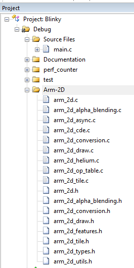

# How to Deploy the Arm-2D Library

This document is part of the **Arm-2D** help documents and introduces how to deploy the **Arm-2D** software library to your existing project(s). If you are not familiar with **Arm-2D**, we recommend that you first read the **README** file located in the repository's root directory.


**NOTE:** 

1. This library is a research project used to explore and demonstrate the possibilities of delivering smart-phone modern graphic user interface using low-cost and resource constraint micro-controllers. It is not a committed product from Arm, and the quality of the service is not validated with sophisticated tests but some functional tests. 
2. The library name, i.e. **Arm-2D**, is a temporary term and might be subject to change in the future. The term "the Library" used in this document refers to the **Arm-2D** library unless otherwise. 


## 1 How to Get the Latest Arm-2D Library

Regardless of whether there are other methods of release later, you can always get the latest content by cloning the Arm-2D software repository on Github using the following command line:

```
git clone https://github.com/ARM-software/EndpointAI.git
```

As you can see, the Arm-2D is part of the EndpointAI software package. Considering that EndpointAI will become bigger and bigger, if you only care about the Arm-2D, you can extract the " ***./Kernels/Research/Arm-2D*** " folder out, as it is a standalone library.


## 2 How to Deploy the Library

### 2.1 Deploy to an MDK project 

1. Copy the Arm-2D folder to your target project directory.

2. Open the MDK project, add a group in the project browser and give it a name, for example, "Arm-2D".

3. Add all the C source code in the "./library/Source" directory to the Arm-2d group of the project.

4. For ease of use, it is recommended that all header files in the "Library/Include" directory that are not prefixed with double underscores should also be added to the Arm-2d group of the project.

   

   **Figure 2-1 A typical project view after Arm-2D Is added**

    

   

5. Add a search path to MDK project configuration for the Arm-2D header files as shown in **Figure 2-2**:

   **Figure 2-2 Add search path to the project configuration for Arm-2D header files**

    

   

6. Enable **C11** and **GNU extension** support in C/C++(AC6) configurations:

   **Figure 2-3 Enable "gnu11" in Arm Compiler 6**

    

   

7. As the Arm-2D relies on **CMSIS 5.7.0** and above (If you want to use Arm-2D with Cortex-M55, you need **CMSIS 5.8.0** which you can get from [Github](https://github.com/ARM-software/CMSIS_5)), we should check the **RTE configuration** and ensure proper CMSIS support has been added to the project (as shown in **Figure 2-4** the **CORE** should be selected).

   **Figure 2-4 Check the CMSIS support in the RTE configuration window**

    

   

8. Some features of the Arm-2D can be enabled/disabled manually according to the platform and applications. A series of macros start with "***\_\_ARM\_2D\_HAS\_\_***" are introduces to control those features. Users have to define them in the project configuration to enable corresponding features.  **Table 2-1** list all available macros.

   **Table 2-1 A summary of feature control macros**

   | Macro                               | Description                                                  | Default                           |
   | ----------------------------------- | ------------------------------------------------------------ | --------------------------------- |
   | ***\_\_ARM\_2D\_HAS\_ASYNC\_\_***   | A macro to enable/disable asynchronous mode in the Programmers' mode of the Arm-2D.  If you don't have any hardware accelerator and only want to use the library in classic synchronous mode (writing blocking code), **set this macro to "0" can bring additional performance uplift.** | Enabled(**1**)                    |
   | ***\_\_ARM\_2D\_HAS\_HELIUM\_\_***  | A macro used to enable/disable Helium support.  **Please note that this macro is defined and maintained by the Arm-2D library, and users should not define it.** In some version of CMSIS, if you want to enable Helium support for your Cortex-M55 processor, please define a macro called ***ARM\_MATH\_HELIUM*** manually, which in the long run will be defined by CMSIS automatically, and users should not define it manually. | Depends on other Compiler Options |
   | ***\_\_ARM\_2D\_HAS\_HW\_ACC\_\_*** | Do **NOT** define it in this version.                        | Disabled(**0**)                   |
   | ***\_\_ARM\_2D\_HAS\_CDE\_\_***     | Do **NOT** define it in this version.                        | Disabled(**0**)                   |

   

9. Include the header file "***arm_2d.h***" in your source code where you want to use the library:

   ```c
   #include "arm_2d.h"
   ```

   

10. Initialise the Arm-2D library before using any services by calling a function-like macro, ***arm_2d_init()*** . Its actual content varies depending on the feature control macros mentioned in **Table 2-1**.

```c
static void system_init(void)
{
    ...
    arm_2d_init();
    ...
}
```


11. There are other configurations helpful when using the library list in **Table 2-2.**

    **Table 2-2 Useful Configurations**

    | Configuration        | Option                | Compiler(s)               | Description                                                  |
    | -------------------- | --------------------- | ------------------------- | :----------------------------------------------------------- |
    | Microsoft Extensions | ***-fms-extensions*** | Arm Compiler 6, GCC, LLVM | Enable enhanced support for [Unnamed Structure and Union Fields](https://gcc.gnu.org/onlinedocs/gcc/Unnamed-Fields.html) introduce by Microsoft Extensions. In Arm Compiler 6, when "-fms-extensions" added, you should also add an option " ***-Wno-microsoft-anon-tag*** " to suppress the corresponding warning. **IAR supports this by default.** |


**Figure 2-5 A Typical Configuration for A MDK project**

 

**NOTE:** 

1. This picture shows that the highest level of optimisation (" ***-Omax*** ") is enabled while the link-time-optimisation is disabled (" ***-fno-lto*** "). This is **NOT** a requirement of the Arm-2D library.
2. The ".\perf_counter\lib" list in the **Include Paths** is **NOT** required by the Arm-2D library. It is merely part of the application. 
3. The option "Short enums/wchar" is **NOT** required by Arm-2D library. This option is enabled by default if you create a new MDK project using Arm Compiler 6.


## 3 Other Useful information

### 3.1 Examples 

**Table 3-1 Examples List**

| Example              | Description                                                  | Folder                         | Note               |
| -------------------- | ------------------------------------------------------------ | ------------------------------ | ------------------ |
| Alpha-Blending       | It is an **ALL-IN-ONE** example that demonstrates almost all the features provided by the library. | examples/alpha_blending        | Used as benchmark. |
| Partial-Frame-buffer | **It delivers the same visual effects as Alpha-blending example but using Partial-Frame-buffer**. It can be used as a template or reference code for programmers who want to implement a graphical user interface on an MCU with small RAM. In this example, **16*16 FPB (512Bytes) is used, and the total system RAM usage is less than 2.5KByte** (including stack, heap and FPB). | examples/partial_frame_buffer. |                    |
| watch_panel          | It is a dedicated example for smart-watch like panel. For current version, it is only used to demonstrate rotation algorithms with two spinning gears. Each gear rotates at a different angular velocity and both Colour-masking and alpha-masking schemes are applied. | examples/watch_panel           | Used as benchmark  |


### 3.2 How To Read the Library In Users' View

- For library users, **ALL** useful information, i.e. type definitions, macros, prototypes of functions etc., are stored in header files which have **NO** double under-scope as their prefixes. We call those header files the **PUBLIC HEADER FILES**. 
- Please **ONLY** use APIs, macros and types that are defined in the public header files. 

**Figure 3-1 Private and Public Files** 

 

- Any symbol, e.g. file name, function name, macro name, type name etc., having a double under-scope as the prefix is considered as **PRIVATE** to the library. You should save your time from touching them. 

- The library is designed with the philosophy that Users are free to use anything in public header files and should not touch anything marked implicitly or explicitly as private. 

- Despite which processor you use, during the compilation, all C source files are safe to be added to the compilation (and we highly recommend you to do this for simplicity reason). For example, when you use Cortex-M4, which doesn't support Helium extension (introduced by Armv8.1-M architecture and first implemented by the Cortex-M55 processor), it is OK to include "***arm_2d_helium.c***" in the compilation process, as the C source files are constructed with environment detection pre-processing mechanisms. 

- In your application, only including "arm_2d.h" is sufficient to get all the services and APIs ready for you. 

- Make sure that the library is initialised by calling **arm_2d_init()** before using any of the services. 

