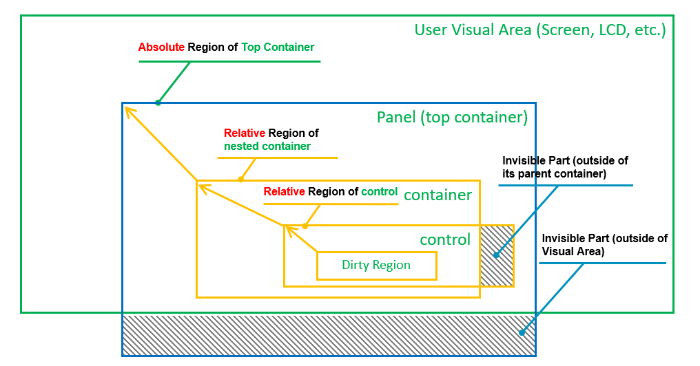
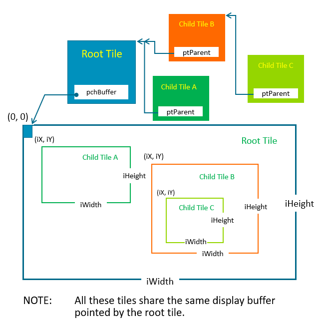

# Introduction for Arm-2D

As part of the Arm-2D help document, this article mainly explains and introduces some basic concepts and necessary knowledge of using Arm-2D. It doesn't matter whether you have read the **README** document (in the root directory) or not. The content of this article is suitable for users who are new to the Arm-2D concept. 

**NOTE:** 

1. This library is a research project used to explore and demonstrate the possibilities of delivering smart-phone modern graphic user interface using low-cost and resource constraint micro-controllers. It is not a committed product from Arm, and the quality of the service is not validated with sophisticated tests but some functional tests. 

2. The library name, i.e. **Arm-2D**, is a temporary term and might be subject to change in the future. The term "the Library" used in this document refers to the **Arm-2D** library unless otherwise. 

   

## 1 Overview

At the beginning of your adventure, we try to answer some questions you are likely to ask, such as:

- what is Arm-2D? 
- what problems does it solve? 
- Who are the users it faces? 
- What are the parts of Arm-2D? 
- What assumptions does it make about the environment in which it is used? and 
- What are the restrictions?

We hope this could help you with a wonderful journey. 

### 1.1 What is Arm-2D 

If you want to use a graphical interface in the Linux environment, you don’t have to face hardware such as GPU directly. In fact, the Linux ecosystem will provide you with mature software support, which includes drivers for GPU, GUI stacks and a large number of handy interface reference designs.

Unfortunately, if you are an embedded developer who mainly uses Cortex-M, due to the lack of a mature software system like that the Linux ecosystem has, you may have to face various non-standard LCD hardware modules directly. If you are lucky, you also need to face the non-standard 2D graphics accelerators provided by different chip manufacturers. Although you have many GUI stacks to choose from, most of them lack direct support for a specific device, and then you have to port the GUI to your own platform, solving problems between low-level hardware acceleration and high-level software. In summary, it is feasible to use GUI in the Cortex-M system, but most of the time, we need to take care of almost every detail.

**Figure 1-1 Ecosystem Comparison between Rich Embedded and Constraint Embedded System in GUI**

 


**Arm-2D is not about reinventing a GUI or competing with the existing GUI stacks.** In fact, the problem Arm-2D wants to solve is how to **provide a unified low-level hardware acceleration interface for all GUI stacks** so that these high-level software service providers are no longer tired of writing drivers for a large number of emerging non-standard embedded hardware platforms. Once Arm-2D becomes a tacit understanding between GUI providers and chip manufacturers, everyone can perform their duties to maximise cooperation within the entire embedded ecosystem.


**Figure 1-2 The Hierarchy of a Typical Embedded GUI System.**

 

To put it simple, **Arm-2D focuses on low level 2D image processing and provides a unified software interface for the vastly different 2D accelerators.**


### 1.2 Target Audiences

In the Arm-2D story, there are at least 3 types of participants: GUI service providers, silicon vendors, and bare-metal system developers.

#### 1.2.1 GUI Service Provider

GUI service providers are the main beneficiaries of Arm-2D. Since Arm-2D provides a standard interface for hardware acceleration commonly required by GUI services, in their software package by default, GUI service providers only need to provide a porting version using Arm-2D as a low-level dependency, and it is sufficient to ensure that all Cortex-M processors are covered.

After saving a lot of unnecessary hardware adaptation work, GUI service providers can concentrate on improving the quality of their software services or provide high-value customisation services for their VIP customers.

#### 1.2.2 Silicon Vendor

Semiconductor manufacturers are the main beneficiaries of Arm-2D. As the market and users expect microcontrollers to use processors under the same architecture (to save their time of learning different processors), these semiconductor manufacturers often need to find ways to differentiate their products, hence introducing dedicated 2D graphic acceleration engine to their devices has become a new fashion.

While differentiation in hardware brings benefits to end-users, it also inevitably introduces the problem of software fragmentation. It is common in software engineering to introduce a unified API set, a.k.a. a hardware abstraction layer for fragmented hardware. Based on commonly agreed requirements among upper-level software, Arm-2D actually acts as an abstract layer for different 2D graphic acceleration engines. In this relationship, chip manufacturers only need to implement drivers for their own hardware accelerators following the Arm-2D standard, and it is (for most of the case) sufficient to see that most of the GUI stacks are ready for their devices. 

#### 1.2.3 Bare-metal System Developers

Most bare-metal developers often face a constraint embedded platform. A typical such system has less than 64KB FLASH and 4~32K SRAM. As a reference, a common low-cost serial LCD with 320*240 resolution and 16bit colour require 150KB RAM as just one frame of the display buffer. This is not a comparison of resources of the same order of magnitude at all.

For those deep embedded MCUs, most of the existing GUI stacks are too expensive to use. On the other hand, considering that the application scenarios are often very simple, i.e. GUIs' requirements are also simple, as a result, in many cases, even simple home-brew GUI-like data structures are good enough to meet the application requirements. In summary, most bare-metal developers will not choose the existing GUI stacks as the basis for their GUI-based applications.

When one has to build a GUI-based application from scratch with such resource-constrained microcontrollers, people usually either completely ignore the use of GUI or can only make necessary trade-offs among the following options:

- Implement GUI using only simple shapes, such as points, lines, colour blocks, etc.
- Bearing with high transmission latency, read the pixel back from LCD's internal display buffer, perform certain calculations and write it back
- Only copy/send pre-saved pictures in FLASH to LCD without further image processing.
- Using a technique called the Partial-Frame-Buffer to practise time-space-exchanging

In conclusion, **in the past, it was possible but not easy to implement a modern-looking graphical user interface in a bare-metal environment**. 

Now, Arm-2D not only provides a series of easy to use function templates that help users to implement desired graphic effects but also supports the Partial-Frame-Buffer. It is worth mentioning that the **specific PFB paradigm introduced by Arm-2D is transparent to upper layer software**. This kind of transparency greatly simplifies the application development in a bare-metal environment, i.e. **users can write applications as if the device really has a complete display buffer.**

**In summary, Arm-2D enable a large number of devices (that were traditionally not suitable for modern-looking GUI) to have a fancy GUI with a small memory footprint.**


### 1.3 Arm-2D Libraries

#### 1.3.1 Standard Software Implementation

As a starting point, Arm-2D provides a default software implementation for all algorithms. These software implementations are mainly written in the C language and occasionally include some local assembly acceleration. This ensures that Arm-2D can be used directly on all Cortex-M processors without modification.

#### 1.3.2 Helium Acceleration

If you are using an Armv8.1-M processor, such as Cortex-M55, as long as you enable Helium support with compilation options, **Arm-2D library will automatically use Helium technology for acceleration**. 

#### 1.3.4 Third-party Implementation

Arm-2D has provided standard ways to add support for various third-party hardware accelerators. Although not included now, In the future, we will introduce templates, examples and documents to show how to add support for third-party hardware accelerators. 

#### 1.3.5 Arm Custom Instruction Support

Arm-2D has provided standard ways to add support for 2D image processing algorithms accelerated with customised instructions. Although not included now, In the future, we will introduce templates, examples and documents to show how. 


### 1.4 Scope and Limitations

#### 1.4.1 Scope

- The Arm-2D should fulfil the requirements of Smart-Watch applications
  - at most 640 * 640 resolution, 32bit colours
  - 60 FPS refresh rate
  - Provide support for rotation, anti-alias filters etc.
- The Arm-2D should fulfil the requirements of deep embedded applications in constraint environment
  - A typical MCU with less than 64K Flash and 4~32K SRAM.
  - System frequency is around 48MHz or above.
  - For applications that tolerate low frame-rate ranging from 1FPS to 30FPS.
  - Deliver modern-looking GUI using Partial Frame-buffer (as small as 8*8 PFB, 128Bytes in 16bit colour).
    - Put no limitation on supported resolution size (exchanging RAM with low frame-rate).

#### 1.4.2 Limitations

- The library focus on Cortex-M processors in principle.
- The library should be compiled with the following compilers:
  - Arm Compiler 5
  - Arm Compiler 6
  - GCC
  - LLVM
  - IAR
- The library focus on **Low Level Pixel Processing Acceleration**
  - In principle, the library will **NOT** provide APIs for content creation, such as drawing shape, text display and etc, but simple draw point APIs. 
  - In principle, the library will **NOT** provide data structures or related algorithms which are essential for creating a GUI, for example, element tree, GUI message handling and the tree traversal algorithms.

**NOTE: For the temporary limitations in current version, please check section 5.2 in [README](../README.md) for details.** 


### 1.5 Operation Categories

**Table 1-1 Summary of Operation Categories.** 


### 1.6 Folder Structures

**Table 1-2 The Folder Structure of Arm-2d Root** 

| Folder and File                  | Type   | Description                                                  |
| :------------------------------- | ------ | ------------------------------------------------------------ |
| Library                          | Folder | This folder contains the source files and header files of the library. |
| Documents                        | Folder | This folder contains all the documents.                      |
| Examples                         | Folder | This folder contains all the example projects.               |
| README                           | .md    | The README.md you are currently reading.                     |
| how_to_deploy_the_arm_2d_library | .md    | A step by step guidance helping you to deploy the Arm-2D library to your projects. |
| LICENSE                          |        | The Apache 2.0 License                                       |


## 2 Basics

Arm-2D defines some basic data structures for ease of use, providing a unified description method for various graphic resources and simplifying the parameters that need to be passed to 2D processing APIs. This chapter will introduce some basic concepts and corresponding data structures that you must know to work with the Arm-2D library. Arm-2D systematically introduces a Boxing Model to provide more sophisticated and easy to use 2D graphics operations.

### 2.1 Region

Region is a rectangular area described by the Location (the coordinates of the upper left corner) and the Size information.

```c
typedef struct arm_2d_region_t {
    implement_ex(arm_2d_location_t, tLocation);
    implement_ex(arm_2d_size_t, tSize);
} arm_2d_region_t;
```

**Figure 2-1 Region with Location and Size ** 

 

#### 2.1.1 Location

The coordinate of the Region is defined by the vertices at the upper left corner of the bit rectangle. Its data structure is as follows:

```c
typedef struct arm_2d_location_t {
    int16_t iX;
    int16_t iY;
} arm_2d_location_t;
```

Different from the general Cartesian coordinate system, in graphics, the Y-axis is usually mirrored in the opposite direction, which means that the lower the Y coordinate is, the larger the Y coordinate is. In the Boxing model that will be introduced later, we will understand that the **coordinates of a Region can be negative**, representing the position of the current Region relative to the starting point of its parent Region.

**Figure 2-2 When Location has a negative coordinates.** 

 

As shown in **Figure 2-2**, when the ***x*** and ***y*** coordinates of a Region are both negative, it actually has a considerable area outside (upper left corner) of its parent Region. When we try to find the intersection of the current Region and its parent Region, we will find that only part of the region is valid.

#### 2.1.2 Size

The size information of the Region is described by the Height and Width together. The data structure is defined as follows:

```c
typedef struct arm_2d_size_t {
    int16_t iWidth;
    int16_t iHeight;
} arm_2d_size_t;
```

Although a signed type ***int16_t*** is used to describe the width and height, negative numbers are meaningless and should be avoided.

### 2.2 Boxing Model

The so-called Boxing Model describes the affiliation between Regions, which is often used to describe the relationship between containers and visual elements. 

In a GUI stack, the Boxing Model usually talks about more complex stuff, such as the border's width, the margin inside a container border, the padding of / distance between the elements inside a container etc. Arm-2D does ***NOT*** cares about these details but only describes the simple relationship between a container and the elements inside.

#### 2.2.1 Absolute Location and Relative Location

In Arm-2d, we consider panels or windows as containers, and the Locations of the panels and the windows are their coordinates in the display buffer. **We call this kind of location information that directly describes the coordinates in a display buffer as an Absolute Location**. In **Figure 2-3**, the panel (top container) coordinates are absolute coordinates.

The coordinates of the elements inside a container are described as **coordinates relative to the upper left corner of the parent container**. We call this kind of Locations the **Relative Locations**. In addition to that, since the container is only a special element, container nesting becomes possible.  In **Figure 2-3**, the two innermost Regions have Relative Locations.

**Figure 2-3 A Typical Example of Absolute Locations and Relative Locations**

   

#### 2.2.2 Absolute Region and Relative Region

If a Region has absolute Location, it is an **Absolute Region**; similarly, if a  Region has relative Location, it is a **Relative Region**.

**Figure 2-4 A Typical Example of Absolute Regions and Relative Regions**

 

When we use these relative and absolute information to perform visual area calculations, it is easy to exclude those areas that are actually invisible to the user from various graphic operations, thereby improving the overall 2D processing performance (as shown in **Figure 2-4** ).


### 2.3 Tile

Tile is the smallest unit of various 2D operations in Arm-2D. The Tile data structure consists of three parts:

- Feature of the Tile
- Region of the Tile and 
- Pointers

The C definition of a the Tile data structure is shown below:

```c
typedef struct arm_2d_tile_t arm_2d_tile_t;
struct arm_2d_tile_t {
    implement_ex(struct {
        uint8_t    bIsRoot              : 1;    //!< is this tile a root tile
        uint8_t    bHasEnforcedColour   : 1;    //!< does this tile contains enforced colour info
        uint8_t                         : 6;
        uint8_t                         : 8;
        uint8_t                         : 8;
        arm_2d_color_info_t    tColourInfo;     //!< enforced colour
    }, tInfo);

    implement_ex(arm_2d_region_t, tRegion);

    union {
        /*! when bIsRoot is true, phwBuffer is available,
         *! otherwise ptParent is available
         */
        arm_2d_tile_t       *ptParent;
        uint16_t            *phwBuffer;
        uint32_t            *pwBuffer;
        uint8_t             *pchBuffer;
    };
};
```


**Table 2-1 The Functionality of Each Members In *arm_2d_tile_t***

| Member                   | Category     | Type                      | Description                                                  | Note                                                         |
| ------------------------ | ------------ | ------------------------- | ------------------------------------------------------------ | ------------------------------------------------------------ |
| ***bIsRoot***            | Feature Info | bit-field                 | This bit indicates that whether a tile is a root tile or not. If it is "***1***", the target tile is a root tile that contains a pointer pointing to a display buffer. If it is "***0***", the target tile is a child tile that contains a pointer pointing to a parent tile which **NOT** necessarily to be a root tile. | See **[section 2.3.1](#231-root-tile)** and **[2.3.2](#232-child-tile)** for details. |
| ***bHasEnforcedColour*** | Feature Info | bit-field                 | This bit indicates that whether a tile explicitly contains a descriptor for pixel colour. When this bit is set, ***tColourInfo*** is valid; otherwise, it is seen as containing no valid information.  If a Tile is used as the source tile of any Colour Conversion Operations, this bit has to be set and ***tColourInfo*** should contain a valid description. | For most of the Arm-2d operations, when this bit is zero, arm-2d API will use its own implicit understanding about the tile colour.  For example, ***arm_2d_rgb16_tile_copy()*** has describe its implicit colour, i.e. ***RGB16*** in function name, hence even ***bHasEnforcedColour*** is set and ***tColourInfo*** contains valid information, the operation still considers both the source and target tiles using ***RGB16***. |
| ***tColourInfo***        | Feature Info | ***arm_2d_color_info_t*** | When ***bHasEnforcedColour*** is set, tColourInfo should contain a valid descriptor about the colour used in the target Tile. | See **[section 2.4](#24-colour)** for details.               |
| ***tRegion***            | Region       | ***arm_2d_region_t***     | Depends on the type of a given tile, ***tRegion*** has a different meaning. | See **[section 2.3.1](#231-root-tile)** and **[2.3.2](#232-child-tile)** for details. |
| ***ptParent***           | Pointers     | ***arm_2d_tile_t \****    | When ***bIsRoot*** is "***0***", this pointer is used to point the parent tile. | See **[section 2.3.1](#231-root-tile)** for details.         |
| ***phwBuffer***          | Pointers     | ***uint16_t \****         | When ***bIsRoot*** is "***1***", this pointer is used to point to a display buffer that contains 16-bit pixels. | See **[section 2.3.1](#231-root-tile)** for details.         |
| ***pwBuffer***           | Pointers     | ***uint32_t \****         | When ***bIsRoot*** is "***1***", this pointer is used to point to a display buffer that contains 32-bit pixels. | See **[section 2.3.1](#231-root-tile)** for details.         |
| ***pchBuffer***          | Pointers     | ***uint8_t \****          | When ***bIsRoot*** is "***1***", this pointer is used to point to a display buffer that contains pixels that have less or equals to 8bits. | See **[section 2.3.1](#231-root-tile)** for details.         |

[]: 


#### 2.3.1 Root Tile

A Root tile is a kind of tiles that directly contain the display buffer, and its feature bit ***bIsRoot*** is set, according to the pixel types used in the display buffer to which corresponding pointers should be used. For more details, please refer to **Table 2-1**.

It is worth emphasizing that for a root Tile, its Location coordinate must be ***(0,0)***; otherwise, it is considered illegal.

With the help of [C99 designator](https://gcc.gnu.org/onlinedocs/gcc/Designated-Inits.html), a tile structure can be initialised clearly and easily. The following example shows a root tile ***c_tPictureCMSISLogo*** representing a ***RGBA8888*** bitmap stored in a constant array called ***c_bmpCMSISLogo[]***. Note that because the bitmap and the tile structure are designated as constants, it is highly likely that a compiler will use ROM rather than RAM to store them and keep a small RAM footprint. 

```c
/*! picture cmsis_logo */
extern const uint8_t c_bmpCMSISLogo[163 * 65 * sizeof(uint32_t)];
const static arm_2d_tile_t c_tPictureCMSISLogo = {
    .tRegion = {
        .tSize = {
            .iWidth = 163,
            .iHeight = 65
        },
    },
    .tInfo = {
        .bIsRoot = true,
        .bHasEnforcedColour = true,
        .tColourInfo = {
            .chScheme = ARM_2D_COLOUR_RGBA8888,
        },
    },
    .pwBuffer = (uint32_t *)c_bmpCMSISLogo,
};
```

In fact, with the help of some macros, we can use Tile to implement the concept of the so-called visual layer:

```c
#define __declare_tile(__NAME)                                      \
            extern const arm_2d_tile_t __NAME;
#define declare_tile(__NAME)            __declare_tile(__NAME)

#define __implement_tile(__NAME, __WIDTH, __HEIGHT, __TYPE)         \
            ARM_NOINIT static __TYPE                                \
                __NAME##Buffer[(__WIDTH) * (__HEIGHT)];             \
            const arm_2d_tile_t __NAME = {                          \
                .tRegion = {                                        \
                    .tSize = {(__WIDTH), (__HEIGHT)},               \
                },                                                  \
                .tInfo.bIsRoot = true,                              \
                .pchBuffer = (uint8_t *)__NAME##Buffer,             \
            }
            
#define implement_tile(__NAME, __WIDTH, __HEIGHT, __TYPE)           \
            __implement_tile(__NAME, __WIDTH, __HEIGHT, __TYPE)
```

For example, we can create two visual layers with size **100\*100** and ***200\*50*** respectively and using colour ***arm_2d_color_rgb565_t*** for pixels:

```c
declare_tile(c_tLayerA)
implement_tile(c_tLayerA, 100, 100, arm_2d_color_rgb565_t);

declare_tile(c_tLayerB)
implement_tile(c_tLayerB, 200, 50, arm_2d_color_rgb565_t);
```

These layers are stored in RAM, which are used as sources and targets for 2D operations. 

Note that in the aforementioned macro template, we use ***ARM\_NOINIT*** to decorate the display buffer, its definition is shown below:

```c
#ifndef ARM_NOINIT
#if     defined(__IS_COMPILER_ARM_COMPILER_5__)
#   define ARM_NOINIT           __attribute__( ( section( ".bss.noinit"),zero_init) )
#elif   defined(__IS_COMPILER_ARM_COMPILER_6__)
#   define ARM_NOINIT           __attribute__( ( section( ".bss.noinit")) )
#elif   defined(__IS_COMPILER_IAR__)
#   define ARM_NOINIT           __no_init
#elif   defined(__IS_COMPILER_GCC__) || defined(__IS_COMPILER_LLVM__)
#   define ARM_NOINIT           __attribute__(( __section__( ".bss.noinit")))
#else
#   define ARM_NOINIT
#endif
#endif
```

It is clear that for the Arm Compiler 5 and Arm Compiler 6, ***ARM_NOINIT*** puts the target variable into a ***ZI*** section called ***".bss.noinit"*** which later should be placed in an execution region with ***[UNINIT](https://developer.arm.com/documentation/101754/0616/armlink-Reference/Scatter-File-Syntax/Execution-region-descriptions/Execution-region-attributes)*** feature in a scatter-script, for example:

```
LR_ROM __ROM_BASE __ROM_SIZE  {                           
    ...

    ARM_LIB_STACK __RAM1_BASE ALIGN 8 EMPTY __STACK_SIZE { ; Reserve empty region for stack
    }

    RW_RAM1 +0 __RAM1_RW_SIZE {
        * (+RO-DATA)
        * (+RW +ZI)
    }

    RM_RAM_NOINIT +0 UNINIT {
        * (.bss.noinit)
    }

    ARM_LIB_HEAP  __HEAP_BASE ALIGN 8 EMPTY __HEAP_SIZE  { ; Reserve empty region for heap
    }
    ...
}
```


#### 2.3.2 Child Tile

Given any tile, we can derive a theoretically unlimited number of sub-tiles based on it, which are called Child Tiles in Arm-2D. It is worth emphasizing that the Tile that can be used to derive child tiles does not need to be a root Tile. The ***bIsRoot*** flag of the Child Tile is 0, which means that the pointer ptParent points to its parent Tile. 

The Location information of the child tile is used to indicate its location in the parent tile. Negative numbers are allowed for the coordinates here. The region of a child tile can be larger than the size of the parent tile. This is often used to implement the Partial Frame-buffer. For more, please refer to **[section 2.3.3](#233-partial-frame-buffer)**. 

Figure 2-3 shows a series of Child Tiles, and their derivation relationship in the form of Region View.

**Figure 2-3 A Chain of Child Tiles and Their Root Tile**

 

The introduction of Child Tiles can greatly simplify the storing and representing of GUI resources. Smart designers can even put many image elements in the same picture and retrieve them by creating Child Tiles with different sizes from different locations. In practice, A multi-level Child Tile suffers almost no performance loss in 2D operations.


#### 2.3.3 Partial Frame Buffer

The so-called Partial Frame Buffer is a special use of the Tile Child scheme. It establishes a root Tile for a tiny rectangular display buffer and derives a Child Tile having the same size as the actual screen. In practice, the GUI software in the upper layer uses the Child Tile (with the full-screen size) to draw graphics and blend visual layers. After completing a frame, the PFB that actually saves the pixel information is sent to the LCD driver for a flush. Since FPB only covers a small area, the drawing process aforementioned, in most cases, will be judged as "no need for actual drawing" and skipped. To display the entire screen, we need to repeat this process continuously and adjust the relative Location between FPB and the Child Tile at the beginning of each iteration. For us, it looks like moving FPB line by line on the screen as shown in **Figure 2-4**.

**Figure 2-4 How Partial Frame Buffer Works**

 

More details are shown in a dedicated example project located in "***examples/partial_frame_buffer***" directory.


### 2.4 Colour

Arm-2D has reserved sufficient space for supporting more colour formats. A data structure has been introduced to describe a colour format used in a given tile. The C definition is shown below:

```c
//! \name colour size
//! @{
enum {
    ARM_2D_COLOUR_SZ_1BIT = 0,            //!< 1 bit:black and white
    ARM_2D_COLOUR_SZ_2BIT = 1,            //!< 4 colours or 4 gray-levels
    ARM_2D_COLOUR_SZ_4BIT = 2,            //!< 16 colours or 16 gray-levels
    ARM_2D_COLOUR_SZ_8BIT = 3,            //!< 256 colours
    ARM_2D_COLOUR_SZ_16BIT = 4,           //!< 16bits
    ARM_2D_COLOUR_SZ_32BIT = 5,           //!< true colour

    ARM_2D_COLOUR_SZ_1BIT_msk =   ARM_2D_COLOUR_SZ_1BIT << 1,
    ARM_2D_COLOUR_SZ_2BIT_msk =   ARM_2D_COLOUR_SZ_2BIT << 1,
    ARM_2D_COLOUR_SZ_4BIT_msk =   ARM_2D_COLOUR_SZ_4BIT << 1,
    ARM_2D_COLOUR_SZ_8BIT_msk =   ARM_2D_COLOUR_SZ_8BIT << 1,
    ARM_2D_COLOUR_SZ_16BIT_msk =  ARM_2D_COLOUR_SZ_16BIT<< 1,
    ARM_2D_COLOUR_SZ_32BIT_msk =  ARM_2D_COLOUR_SZ_32BIT<< 1,

    ARM_2D_COLOUR_LITTLE_ENDIAN       = 0,
    ARM_2D_COLOUR_BIG_ENDIAN          = 1,

    ARM_2D_COLOUR_LITTLE_ENDIAN_msk   = ARM_2D_COLOUR_LITTLE_ENDIAN << 4,
    ARM_2D_COLOUR_BIG_ENDIAN_msk      = ARM_2D_COLOUR_BIG_ENDIAN    << 4,

    ARM_2D_COLOUR_NO_ALPHA = 0,
    ARM_2D_COLOUR_HAS_ALPHA = 1,

    ARM_2D_COLOUR_NO_ALPHA_msk        = ARM_2D_COLOUR_NO_ALPHA      << 0,
    ARM_2D_COLOUR_HAS_ALPHA_msk       = ARM_2D_COLOUR_HAS_ALPHA     << 0,
};
//! @}

//! \name colour scheme
//! @{
enum {
    ARM_2D_COLOUR_RGB16       =   ARM_2D_COLOUR_SZ_16BIT_msk    ,
    ARM_2D_COLOUR_RGB565      =   ARM_2D_COLOUR_RGB16    ,

    ARM_2D_COLOUR_RGB32       =   ARM_2D_COLOUR_SZ_32BIT_msk    ,
    ARM_2D_COLOUR_RGB888      =   ARM_2D_COLOUR_RGB32    ,
    ARM_2D_COLOUR_RGBA8888    =   ARM_2D_COLOUR_SZ_32BIT_msk    |
                                    ARM_2D_COLOUR_HAS_ALPHA       ,
};
//! @}


typedef union {
    struct {
        uint8_t bHasAlpha  : 1;     //!< whether the target colour has alpha channel
        uint8_t u3ColourSZ : 3;     //!< the size of the colour
        uint8_t bBigEndian : 1;     //!< whether the colour is stored in big endian
        uint8_t u3Variant  : 3;
    };
    uint8_t chScheme;
} arm_2d_color_info_t;
```


**Table 2-2 The Member of arm_2d_colour_info_t** 

| Member           | Type      | Description                                                  | Note |
| ---------------- | --------- | ------------------------------------------------------------ | ---- |
| ***bHasAlpha***  | bit-field | ***bHasAlpha*** is used to indicate that whether the target colour format contains an alpha channel or not. Here “***1***” means that the Alpha channel is included, and vice versa. |      |
| ***u3ColourSZ*** | bit-field | ***u3ColourSZ*** is used to indicate the data length of each pixel. The valid values are represented as enumerations starting with " ***ARM\_2D\_COLOUR_SZ\_*** ". |      |
| ***bBigEndian*** | bit-field | ***bBigEndian*** is used to indicate whether the pixel is stored in Big-Endian. |      |
| ***u3Variant***  | bit-field | In some rare cases that the aforementioned bit fields refer to more than one colour format, the ***u3Varient*** can be used to encode at most 8 different variants. |      |
| ***chScheme***   | uint8_t   | An 8bit representation of the bit fields aforementioned. It is very efficient in comparison. Enumerations starting with " ***ARM\_2D\_COLOUR\_*** " represent the colour formats currently supported in the Arm-2D library. For example, ***ARM_2D_COLOUR_RGB565***. |      |

In addition to the colour format descriptor, the current version of the Arm-2D library also defines data structures for the supported colour formats:

```c
typedef union arm_2d_color_rgb565_t {
    uint16_t tValue;
    struct {
        uint16_t u5R : 5;
        uint16_t u6G : 6;
        uint16_t u5B : 5;
    };
} arm_2d_color_rgb565_t;

/*! \brief In most cases four equal-sized pieces of adjacent memory are used,
 *!        one for each channel, and a 0 in a channel indicates black color or
 *!        transparent alpha, while all-1 bits indicates white or fully opaque
 *!        alpha. By far the most common format is to store 8 bits (one byte)
 *!        for each channel, which is 32 bits for each pixel.
 *!
 *!        (source: https://en.wikipedia.org/wiki/RGBA_color_model#ARGB32)
 */
typedef union arm_2d_color_rgba8888_t {
    uint32_t tValue;
    struct {
        uint32_t u8R : 8;
        uint32_t u8G : 8;
        uint32_t u8B : 8;
        uint32_t u8A : 8;
    };
} arm_2d_color_rgba8888_t;


typedef union arm_2d_color_rgb888_t {
    uint32_t tValue;
    struct {
        uint32_t u8R : 8;
        uint32_t u8G : 8;
        uint32_t u8B : 8;
        uint32_t     : 8;
    };
} arm_2d_color_rgb888_t;
```

NOTE: The RGBA8888 is not fully supported in current version of Arm-2D but referenced in some part of the library. 


### 2.4 API Usage Modes

Arm-2D APIs can be used in both Synchronous mode and Asynchronous mode. In fact, The Arm-2D library is designed for working asynchronously, and wrappers are added to support synchronous mode. 

#### 2.4.1 Synchronous Mode

The Synchronous mode is also known as the classic mode, in which a function call won't return until the service is finished or an error occurred. In the current version of the Arm-2D library, all examples are written in Synchronous mode. 

#### 2.4.2 Asynchronous Mode

The Asynchronous mode is good for the event-driven design paradigm, and it is suitable for most of the RTOS based applications and applications that are written in protoThread and/or FSM in the bare-metal system. 

The examples and documents for Asynchronous mode will be added soon.

## 3 API Summary

### 3.1 Tile Operations

| Function Name                                    | Description                                                  | NOTE |
| ------------------------------------------------ | ------------------------------------------------------------ | ---- |
| ***arm_2d_is_root_tile***                        | A function used to check whether a given tile is a root tile or not. |      |
| ***arm_2d_region_intersect***                    | A function used to perform region intersection.              |      |
| ***arm_2d_is_point_inside_region***              | A function used to check whether a point is inside a given region or not. |      |
| ***arm_2d_tile_get_root***                       | For a given tile, return its root tile and the valid region inside that root tile. |      |
| ***arm_2d_tile_generate_child***                 | Generate a Child Tile for a given Tile with a target region inside the given tile. |      |
| ***arm_2d_rgb16_tile_copy***                     | Copy or Fill a given tile into a target tile. Both tiles should use 16bits for each pixel. |      |
| ***arm_2d_rgb32_tile_copy***                     | Copy or Fill a given tile into a target tile. Both tiles should use 32bits for each pixel. |      |
| ***arm_2d_rgb16_tile_copy_with_colour_masking*** | Copy a given tile into a target tile with the Colour-Masking scheme. Both tiles should use 16bits for each pixel. |      |
| ***arm_2d_rgb32_tile_copy_with_colour_masking*** | Copy a given tile into a target tile with the Colour-Masking scheme. Both tiles should use 32bits for each pixel. No alpha channel is used in this function. |      |


### 3.2 Colour Space Conversion

| Function Name                         | Description                                                  | NOTE |
| ------------------------------------- | ------------------------------------------------------------ | ---- |
| ***arm_2d_convert_colour_to_rbg888*** | Convert a tile with any other colour format into a new tile with ***RGB888***. |      |
| ***arm_2d_convert_colour_to_rgb565*** | Convert a tile with any other colour format into a new tile with ***RGB565***. |      |


### 3.3 Alpha Blending 

| Function Name                                          | Description                                                  | NOTE |
| ------------------------------------------------------ | ------------------------------------------------------------ | ---- |
| ***arm_2d_rgb565_alpha_blending***                     | Blend a source tile to a target tile with a given transparency ratio. Both tiles should use ***RGB565*** colour format. |      |
| ***arm_2d_rgb888_alpha_blending***                     | Blend a source tile to a target tile with a given transparency ratio. Both tiles should use ***RGB888*** colour format. ***RGBA8888*** will be treated as ***RGB888***. |      |
| ***arm_2d_rbg565_alpha_blending_with_colour_masking*** | Blend a source tile to a target tile with a given transparency ratio and the Colour-Masking scheme. Both tiles should use ***RGB565*** colour format. |      |
| ***arm_2d_rbg888_alpha_blending_with_colour_masking*** | Blend a source tile to a target tile with a given transparency ratio and the Colour-Masking scheme. Both tiles should use ***RGB888*** colour format. ***RGBA8888*** will be treated as ***RGB888***. |      |
| ***arm_2d_rgb565_fill_colour_with_alpha***             | Fill a given region in the target tile with a specified colour and transparent ratio. Both the target tile and filled colour will be treated as ***RGB565***. |      |
| ***arm_2d_rgb888_fill_colour_with_alpha***             | Fill a given region in the target tile with a specified colour and transparent ratio. Both the target tile and filled colour will be treated as ***RGB888***. |      |


### 3.4 Mirroring/Rotation

To be added in future versions.


### 3.5 Zooming/Stretching

To be added in future versions.


### 3.6 Drawing

| Function Name                      | Description                                                  | NOTE                                                         |
| ---------------------------------- | ------------------------------------------------------------ | ------------------------------------------------------------ |
|                                    |                                                              |                                                              |
| ***arm_2d_rgb16_draw_point_fast*** | Draw a 16bit pixel to a given root tile.                     |                                                              |
| ***arm_2d_rgb32_draw_point_fast*** | Draw a 32bit pixel to a given root tile.                     |                                                              |
| ***arm_2d_rgb16_draw_point***      | Draw a 16bit pixel to a given tile. This function is relatively slower than the "***\_fast***" version but supports the Partial Frame Buffer scheme. |                                                              |
| ***arm_2d_rgb32_draw_point***      | Draw a 32bit pixel to a given tile. This function is relatively slower than the "***\_fast***" version but supports the Partial Frame Buffer scheme. |                                                              |
| ***arm_2d_rgb16_fill_colour***     | Fill a given region inside a tile with a specified 16bit colour. | This function can be used to draw vertical and horizontal lines. |
| ***arm_2d_rgb32_fill_colour***     | Fill a given region inside a tile with a specified 32bit colour. | This function can be used to draw vertical and horizontal lines. |


### 3.7 Filters

To be added in future versions.

