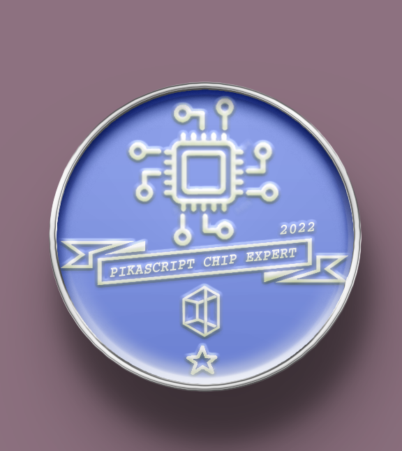
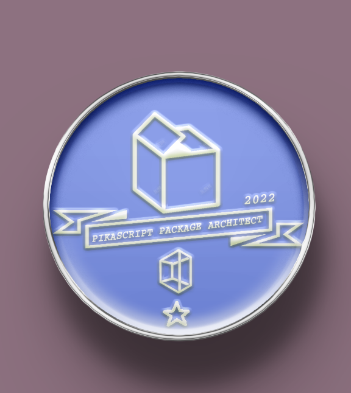
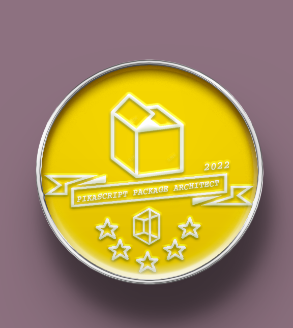
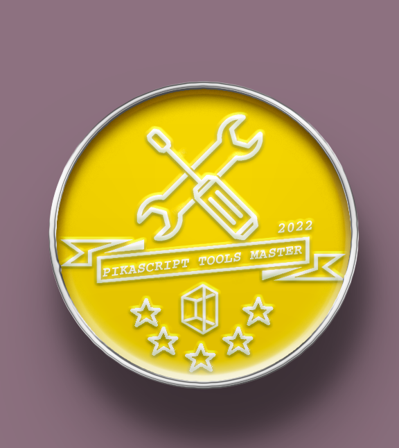

# Achievement Medal 2022

## Statement

- Only the data from August 1, 2021 0:00 GMT to August 1, 2022 0:00 GMT

- The data is mainly from github and gitee, and other data is supplementary.

- The data comes from various sources, so there are inevitably omissions, if you have questions, please discuss through issue

- Achievement medal winners can get the physical medal for free by sending an email to liang6516@outlook.com with the recipient's address, free shipping is included in China.

## Achievement rules - 2022

### PikaScript Chip Expert

- One star: Submitted code for any bsp

- Three stars: submitted a new bsp, or made a hardware driver module

- Five stars: created a hardware driver module based on PikaStdDevice, implementing more than 50% of the PikaStdDevice classes

### PikaScript package Architect 

- One star: submitted arbitrary code to generic packages (not hardware-driven)

- Three stars: Implemented a new class or function for a generic package and wrote unit tests

- Five stars: made a new generic package and wrote a complete unit test

### PikaScript Litterature

- One star: provided detail fixes to pikadoc or pikadoc_en or readme

- Three stars: translate a complete section of pikadoc or pikadoc_en or write complete documentation for a class

- Five stars: write a complete standalone section of pikadoc or pikadoc_en

### PikaScript kernel researcher

- One star: has submitted any kind of patch to the kernel

- Three stars: Optimized kernel speed, resulting in benchmark score increase

 /assets/25.png)

- Five stars: Implemented new syntax or feature enhancements to the kernel

### PikaScript Tool Master

- One star: Submitted a patch for a tool or building block script:

- Three stars: provided support for package management or made a simple new tool

- Five stars: provided new features for the precompiler

### PikaScript commit champion

Based on the largest number of commits on gitee and github, not counting the number of commits by project authors

- One star: top 5 commits

- Three stars: top 3 commits

- 5-star: 1st in number of commits

### PikaScript MVP

- Five stars: get any other five-star badge, or get three three-star badges

