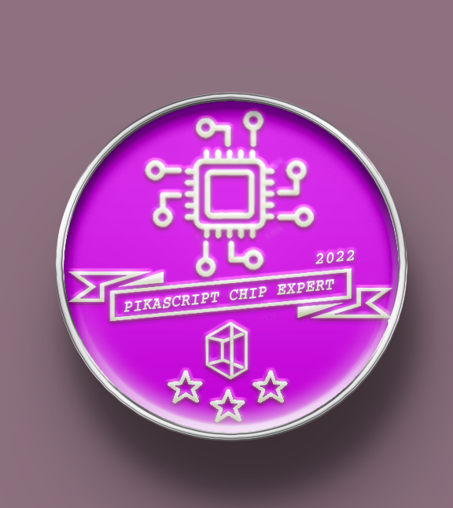
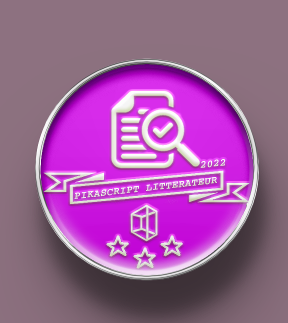
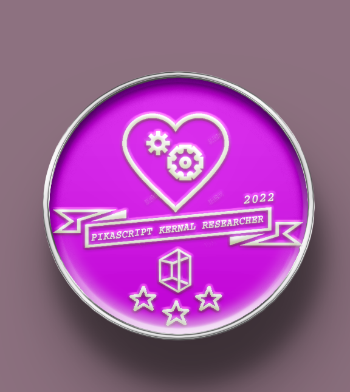
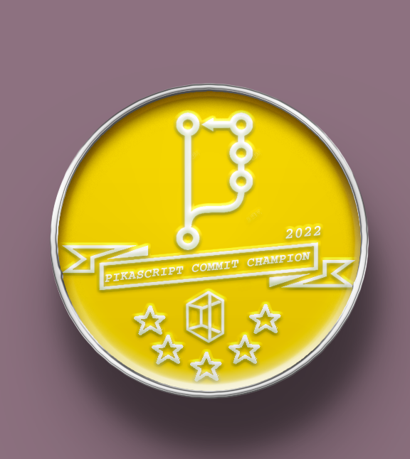
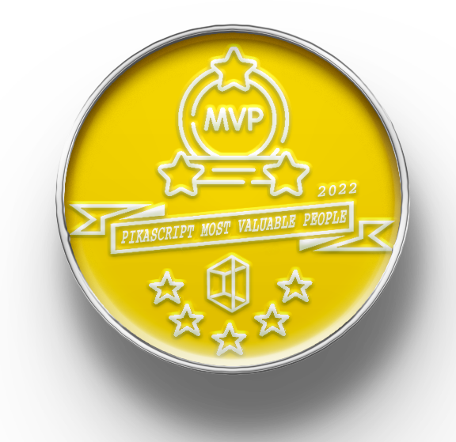

# 成就勋章 2022

## 声明

- 仅统计2021年北京时间8月1日0时至2022年8月1日0时的数据

- 以 github、gitee 数据为主，其他数据为辅

- 数据来源多样，难免有疏漏，如有疑问可通过 issue 讨论

- 成就勋章获得者可以免费得到实体纪念章，通过贡献者邮箱向 liang6516@outlook.com 发送邮件和收件地址获取，中国地区包邮

## 成就获取规则 - 2022年

### PikaScript 芯片专家

- 一星：为任意 bsp 提交了代码

- 三星：提交了新的 bsp，或者制作了硬件驱动模块

- 五星：制作了基于 PikaStdDevice  的硬件驱动模块，实现了超过50%的 PikaStdDevice 类

### PikaScript 模块设计师

- 一星：向通用 package (非硬件驱动型) 提交过任意代码

- 三星：为通用  package 实现了新的类或函数，并编写了单元测试

- 五星：制作了新的通用 package，并编写了完整的单元测试

### PikaScript 文豪

- 一星：向 pikadoc 或 pikadoc_en 或 readme 提供细节修正

- 三星：翻译 pikadoc 或 pikadoc_en 的完整章节或为一个 class 编写完整的文档

- 五星：编写 pikadoc 或 pikadoc_en 完整的独立章节

### PikaScript 内核研究员

- 一星：向内核提交过任意形式的补丁

- 三星：优化了内核的运行速度，使 benchmark 跑分增长

- 五星：为内核实现了新的语法或功能提升

### PikaScript 工具大师

- 一星：提交了工具或构件脚本的补丁:

- 三星：提供了包管理的支持或者制作了简单的新工具

- 五星：为预编译器提供了新的功能

### PikaScript commit 冠军

以 gitee 和 github 的commit 数量最大者计算，不计算项目作者的 commit 数

- 一星：commit 数量前5

- 三星：commit 数量前3

- 五星：commit 数量第1

### PikaScript MVP

- 五星：得到任意一个其他的五星徽章，或者得到三个三星徽章

### 勋章列表

| 贡献者                                                | 勋章                                                         |
| ----------------------------------------------------- | ------------------------------------------------------------ |
| [甜航](https://github.com/easyzoom)                   | 芯片专家-3星 |
| 千帆(微信名)                                          | 芯片专家-3星 |
| [ Meco Jianting Man](https://github.com/mysterywolf)  | 工具大师-1星、芯片专家-3星、commit冠军-3星 |
| [liuduanfei](https://github.com/liuduanfei)           | 芯片专家-3星 |
| [ sjy](https://gitee.com/shanjiayang)                 | 芯片专家-3星、commit冠军-1星 |
| 沧御                                                  | 芯片专家-3星 |
| [versaloon](https://github.com/versaloon)             | 芯片专家-3星、commit冠军-1星 |
| 刘延(微信名)                                          | 芯片专家-5星、MVP-5星 |
| [GorgonMeducer](https://github.com/GorgonMeducer)     | 内核研究员-3星、工具大师-3星、文豪-3星、commit冠军-5星、MVP-5星 |
| [unsigned](https://gitee.com/unsigned0)               | 芯片专家-3星、commit冠军-3星 |
| [梦程MI](https://gitee.com/dreamcmi)                  | 芯片专家-5星、commit冠军-3星、MVP-5星 |
| [Maximilian Gerhardt](https://github.com/maxgerhardt) | 工具大师-1星 |
| [purewind7](https://gitee.com/purewind7)              | 模块设计师-3星、文豪-5星、commit冠军-5星、MVP-5星 |
| [ onceday](https://gitee.com/onceday)                 | 模块设计师-3星、commit冠军-1星 |

